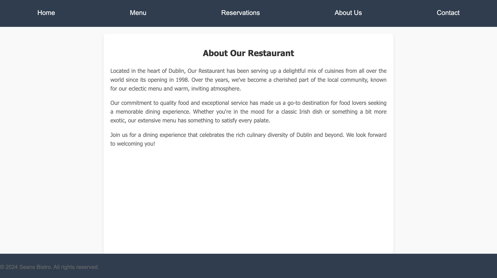

# Web-Development-Project

<!DOCTYPE html>
<html lang="en">
<head>
    <meta charset="UTF-8">
    <meta name="viewport" content="width=device-width, initial-scale=1.0">
</head>
<body>

<h1>Seans Bistro - Restaurant Website</h1>

This is a web development project for a basic restaurant website. The project includes multiple HTML files, CSS for styling, and PHP for server-side scripting. The website is designed to be responsive and user-friendly, featuring different pages for various restaurant functionalities.

<h2>Table of Contents</h2>
<ul>
    <li><a href="#project-structure">Project Structure</a></li>
    <li><a href="#features">Features</a></li>
    <li><a href="#pages">Pages</a></li>
    <li><a href="#technologies-used">Technologies Used</a></li>
    <li><a href="#setup">Setup</a></li>
    <li><a href="#license">License</a></li>
</ul>

<h2 id="project-structure">Project Structure</h2>
<pre>
<code>
SeansBistro/
├── about.html
├── add_item.php
├── admin_dashboard.html
├── contact_form.php
├── create_account.php
├── db_connection.php
├── delete_item.php
├── edit_menu.php
├── edit_reservations.php
├── enquiries.php
├── Restaurant.html
├── login.php
├── menu.php
├── reservation_form.php
├── style.css
└── view_reservations.php
</code>
</pre>

<h2 id="features">Features</h2>
<ul>
    <li><strong>Responsive Design</strong>: Works well on different screen sizes.</li>
    <li><strong>Navigation</strong>: Easy navigation between different pages.</li>
    <li><strong>Menu Display</strong>: A dedicated page to display the restaurant’s menu.</li>
    <li><strong>Contact Form</strong>: A simple contact form for users to reach out to the restaurant.</li>
    <li><strong>Admin Dashboard</strong>: An admin dashboard to manage menu items and reservations.</li>
    <li><strong>User Authentication</strong>: User login and account creation functionalities.</li>
</ul>

<h2 id="pages">Pages</h2>

<h3>about.html</h3>

Provides information about the restaurant's history, mission, and values.

<h3>add_item.php</h3>

Allows admin users to add new items to the restaurant's menu. Includes a form to input item details and a PHP script to handle form submission and database insertion.

<h3>admin_dashboard.html</h3>

The admin dashboard allows administrators to manage menu items and view reservations. Provides links to different administrative functions.

<h3>contact_form.php</h3>

Contains a contact form where users can send inquiries to the restaurant. The form data is submitted to the server and stored in the database.

<h3>create_account.php</h3>

Allows users to create a new account by providing a username, email, and password. The form data is submitted to the server and stored in the database.

<h3>db_connection.php</h3>

Contains the database connection settings used by other PHP scripts to interact with the database.

<h3>delete_item.php</h3>

Allows admin users to delete existing menu items from the database by specifying the item's name.

<h3>edit_menu.php</h3>

Enables admins to edit existing menu items. Fetches item details from the database and provides a form for updating them.

<h3>edit_reservations.php</h3>

Allows admins to edit existing reservations. Fetches reservation details from the database and provides a form for updating them.

<h3>enquiries.php</h3>

Displays all customer inquiries stored in the database. Fetches and lists inquiries in a tabular format.

<h3>Restaurant.html</h3>

The homepage of the restaurant website. Includes a welcome message and links to other pages.

<h3>login.php</h3>

Provides a login form for users to access their accounts. Validates credentials against the database.

<h3>menu.php</h3>

Displays the restaurant's menu items, fetched from the database. Organized by categories with names, descriptions, and prices.

<h3>reservation_form.php</h3>

Allows users to make reservations by providing their details and selecting a date and time. The form data is submitted to the server and stored in the database.

<h3>view_reservations.php</h3>

Displays all reservations stored in the database. Fetches and lists reservations in a tabular format.

<h2 id="technologies-used">Technologies Used</h2>
<ul>
    <li><strong>HTML</strong>: For the structure of the web pages.</li>
    <li><strong>CSS</strong>: For styling the web pages.</li>
    <li><strong>PHP</strong>: For server-side scripting and database interaction.</li>
    <li><strong>MySQL</strong>: For database management.</li>
</ul>

<h2 id="setup">Setup</h2>
<ol>
    <li>Clone the repository to your local machine.</li>
    <li>Set up a web server with PHP and MySQL (e.g., XAMPP, WAMP, or MAMP).</li>
    <li>Import the provided SQL file into your MySQL database to create the necessary tables.</li>
    <li>Update <code>db_connection.php</code> with your database credentials.</li>
    <li>Open the project in your web browser.</li>
</ol>

</body>
</html>
